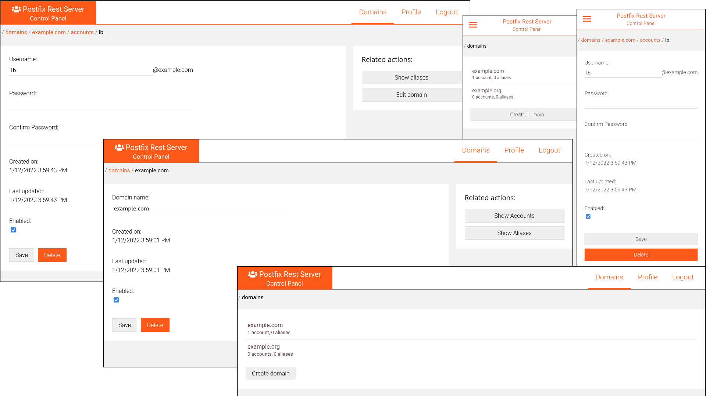

# Postfix REST Server Control Panel

A web UI for controlling the [Postfix REST Server](https://github.com/lyubenblagoev/postfix-rest-server).

Built with React, React Router and Axios.



## Initial setup

```bash
git clone git@github.com:lyubenblagoev/postfix-rest-client.git
cd postfix-rest-client

# Install dependencies
npm install

# Start the frontend
npm start
```

## Starting the backend

In order to use the Postfix Control Panel you need to clone and start the backend project.

Follow the instructions at [https://github.com/lyubenblagoev/postfix-rest-server#rest-server-for-postfix](https://github.com/lyubenblagoev/postfix-rest-server#rest-server-for-postfix)

## Building for production

Run `npm run build` to build the project. The build artifacts will be stored in the `build/` directory.